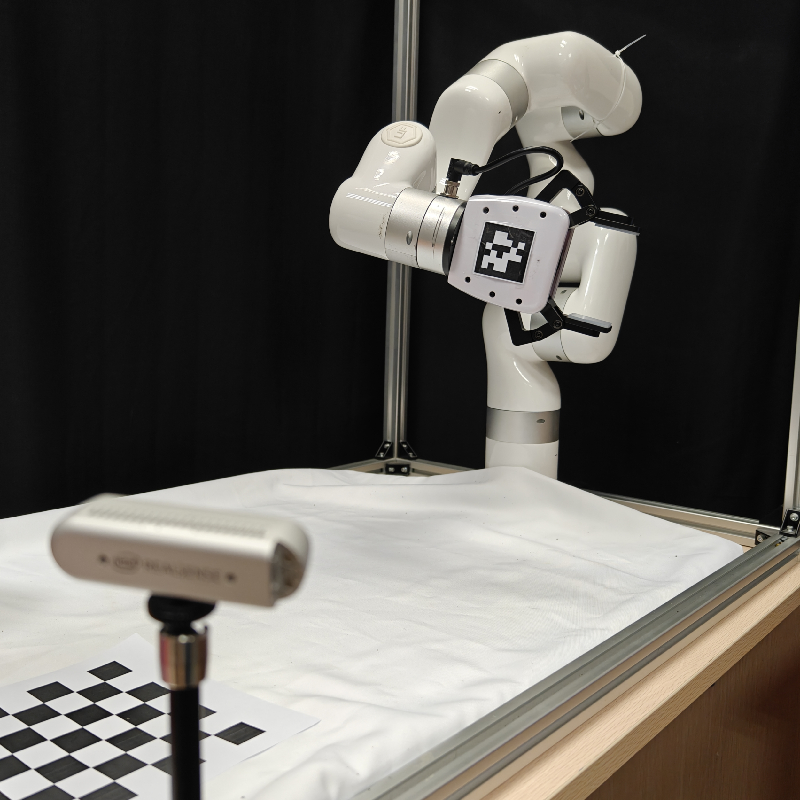
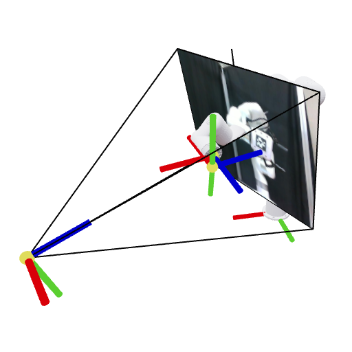
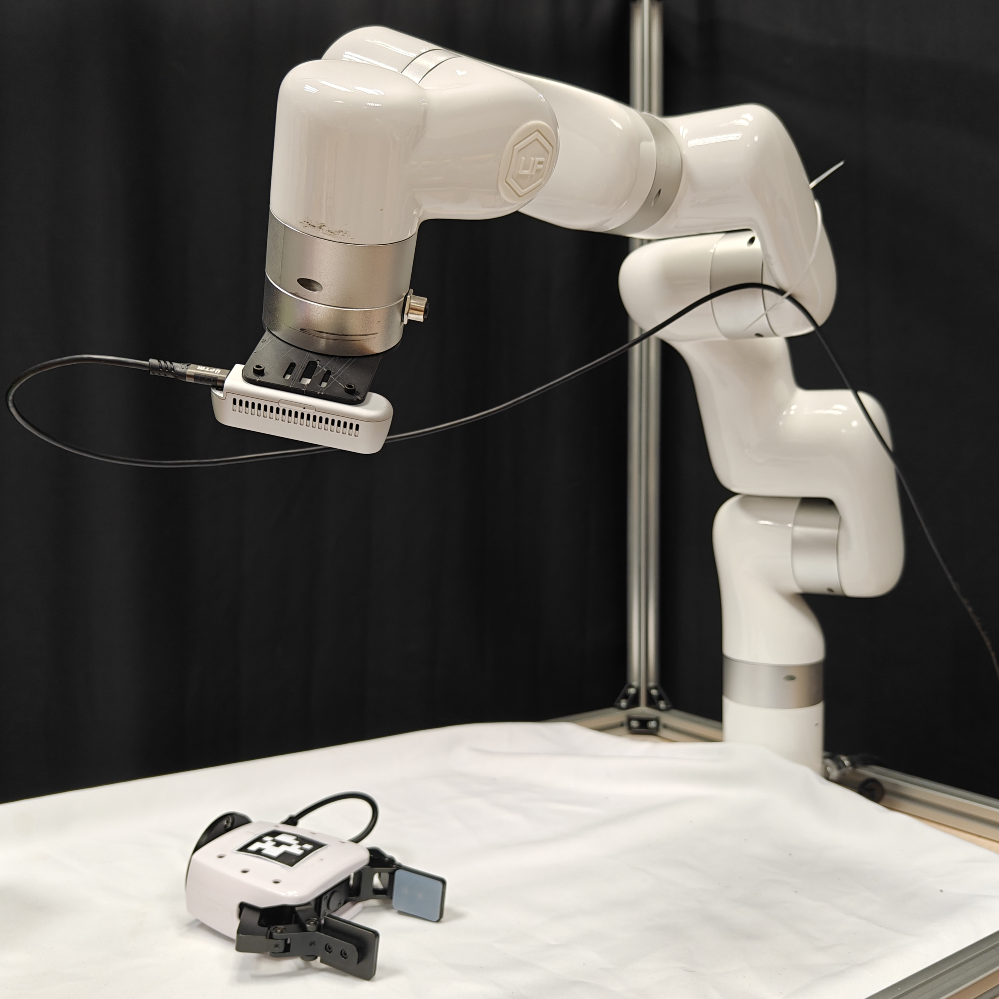
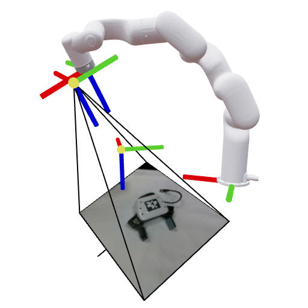

# Minimal Hand-Eye Calibration

Minimal Python tools for camera intrinsics calibration and robot-camera extrinsics calibration, with Viser visualization and simulation checks.

## Install

```bash
pip install -r requirements.txt
```

Use `opencv-contrib-python`, not plain `opencv-python`, because the AprilTag grid generator and simulator use `cv2.aruco`.

## Calibration Targets

Intrinsics target:

- Print `assets/intr_calib_checkerboard.pdf` on A4 at 100% scale.
- The default checkerboard setting in `intr_calib.py` is `(8, 6)` inner corners with `24.0` square size.

Extrinsics target:

- Print `assets/apriltag_grid/compact_apriltag_grid_4x4_tag48mm_a3.pdf` on A3 at 100% scale.
- Keep `assets/apriltag_grid/compact_apriltag_grid_4x4_tag48mm.yaml`; bundle PnP uses it as the board layout.
- The board uses tag36h11 IDs `0-15`, 48 mm marker edges, and a compact 4x4 layout.
- Regenerate the PDF, simulator texture, and YAML with:

```bash
python make_apriltag_grid_pdf.py
```

## Intrinsics

Configure the camera macros at the top of `intr_calib.py`, then run:

```bash
python intr_calib.py
```

The interactive camera window uses:

- `s`: store current frame
- `p`: pause
- `c`: clear buffer
- `q`: finish and calibrate

The default result is saved to `outputs/intrinsics.yaml`.

## Extrinsics

`extr_calib.py` provides two xArm6 examples:

- `thirdview_realsense_xarm6_example()`
- `wrist_realsense_xarm6_example()`

Before collecting real data, update the camera, robot IP, URDF path, and mount link names in the selected example.

Important: the bundled robot model is xArm6 (`assets/robots/xarm6/xarm6_wo_ee.urdf`), not xArm7. For xArm7 or another robot, change the URDF, mount link names, and joint-value handling together. The xArm6 examples assert exactly 6 actuated joint values so a 7-axis setup does not silently use the wrong model.

During calibration, open `http://localhost:8080/` and use the Viser buttons:

- `click_and_append`: append the current robot pose and detected board pose, then solve when enough samples exist.
- `click_and_save`: save the current estimates.

Default outputs:

- third-view: `outputs/extrinsics.yaml`
- wrist: `outputs/extrinsics_wrist.yaml`

## Simulation Checks

Intrinsics simulation, no robot:

```bash
python sim_tests/intr_calib_sim.py --samples 40
```

PyBullet extrinsics simulation, default third-view xArm6 and 4x4 AprilTag board:

```bash
python sim_tests/pybullet_extr_calib_sim.py --mode thirdview --run batch --samples 30
```

OpenCV solver comparison on the same simulated third-view data:

```bash
python opencv_extr_calib.py --sim-thirdview --samples 30
```

Simulation CSV/plot/YAML outputs are written under `sim_tests/outputs/`.

## Visualization Examples

<table>
  <tr>
    <td align="center">
      <br/>
      <sub>Eye on Base (RW)</sub>
    </td>
    <td align="center">
      <br/>
      <sub>Eye on Base (Viser)</sub>
    </td>
  </tr>
  <tr>
    <td align="center">
      <br/>
      <sub>Eye on Hand (RW)</sub>
    </td>
    <td align="center">
      <br/>
      <sub>Eye on Hand (Viser)</sub>
    </td>
  </tr>
</table>
